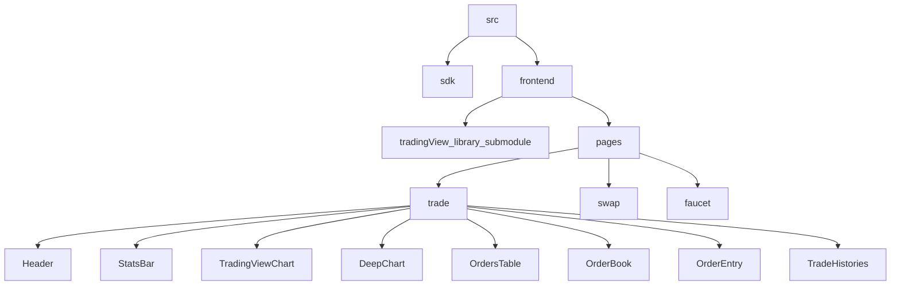

# Econia Frontend

## Prequesites

### 1 - Ensure that you clone the Github repositoty with SSH

> *SKIP this part if you've already use SSH*

Open Terminal and run the following commands:

```bash
git remote set-url origin git@github.com:econia-labs/econia-frontend.git
```

### 2 - Pull the TradingView submodule

> *NOTE: Skip this part if you do not want to show the trading chart or have no access rights to the `TradingView` repository*

The [TradingView](https://github.com/tradingview/charting_library) repository is the submodule of this repository which is used for displaying the trading chart of a specific martket and initialized at `src/frontend/public/static`.

In essence, adding the `TradingView` as a submodule is that you are cloning the `TradingView` repository and build it into static files. Therefore, you need to have the access rights to the `TradingView` repository.
> To get the access rights, you have to contact the `TradingView` team and wait for approval.

Moreover, the submodule path is set up to use SSH protocol with the `github.com` hostname so that you need to manage your SSH keys to make sure that you are using the correct configuration.

#### If you don't have any SSH keys

Follow this [guide](https://docs.github.com/en/authentication/connecting-to-github-with-ssh/generating-a-new-ssh-key-and-adding-it-to-the-ssh-agent) to generate one

In order to make this repository to be able to use the `TradingView`, run the following commands in your terminal:

```bash
git submodule init
git submodule update
```

## Installations

- Get [`pnpm`](https://pnpm.io/installation) if you don't already have it

- Navigate to the Frontend Folder

```bash
cd src/frontend
```

- Install dependencies

```bash
pnpm i # pnpm is required
```

- Copy .env.example file

```bash
cp -R .env.example .env.local
```

- Run the development server:

```bash
pnpm run dev
```

- Open [http://localhost:3000](http://localhost:3000) with your browser to see the result.

## Deploying on Vercel

### 1 - Environment Preparation

To deploy on Vercel, you'll need to set up the following environment variables:

| Variable                                 | Meaning                                                                                |
| ---------------------------------------- | -------------------------------------------------------------------------------------- |
| `NEXT_PUBLIC_ECONIA_ADDR`                | The Econia address                                                                     |
| `NEXT_PUBLIC_FAUCET_ADDR`                | The Econia faucet address                                                              |
| `NEXT_PUBLIC_NETWORK_NAME`               | The network name (for example, testnet)                                                |
| `NEXT_PUBLIC_API_URL`                    | The Econia REST API URL                                                                |
| `NEXT_PUBLIC_RPC_NODE_URL`               | Aptos RPC url                                                                          |
| `GITHUB_ACCESS_TOKEN`                    | Access token for GitHub account with TradingView repo access (only required in Vercel) |
| `NEXT_PUBLIC_UNCONNECTED_NOTICE_MESSAGE` | Message that show in modal when user have not connected wallet yet                     |
| `NEXT_PUBLIC_READ_ONLY`                  | Config read only mode, 1 OR 0                                                          |
| `NEXT_PUBLIC_READ_ONLY_MESSAGE`          | Error message when user attempt do a require sign operator                             |
| `NEXT_PUBLIC_DEFAULT_MARKET_ID`          | Default market id                                                                      |

The variables above will be added into the Vercel project, you can find them at the file `.env.example` or `.env.local` which you created from previous steps. However, the `GITHUB_ACCESS_TOKEN` is still missing, you have to create on your own.

### 2 - Generating a `GITHUB_ACCESS_TOKEN`

To generate a `GITHUB_ACCESS_TOKEN`:

1. Go to https://github.com/settings/tokens/new
1. Provide a descriptive `note`.
1. In `Expiration` selection box, choose `No expiration`
1. In the `Select scopes` section, click on `repo - Full control of private repositories` to select all repository-related options.
1. Click `Generate token`
1. Copy the generated token to your Vercel environment variables and name it `GITHUB_ACCESS_TOKEN`

### 3 - Log into the Vercel system using your Github account

Use your Github account, that has the access to this `econia-frontend` repository, to connect to Vercel.

Now you are navigated to your default team on Vercel and able to create a new project.

### 4 - Create a Vercel project

#### Step 1: Import project

On your screen, click `Add New` button and select `Project` to create a new project or shortly clicks `Import project` to import the Github repository.

The Vercel webiste displays a list of repositories existing in your Github account.

Now click the `Import` button on the `econia-frontend` repository.

#### Step 2: Configure your project

Once imported successfully, Vercel asks you to configure your project and deploy.

1. **Project Name**: The project name is automatically generated, you can change it as you want.

2. **Root Directory**:  At the `Root Directory` field, click the `Edit` button next to it. A modal pops up and tells you to select the directory where your source code is located. Then, you must select the path `econia-frontend/src/frontend` and click `Continue`.

3. **Framework Preset**: As the directory at the above path is a NextJS project then Vercel automatically detects that its `Framework Preset` is NextJS.

4. **Build and Output Settings**: Override the `Install Command` with the following:

    ```bash
    npm run vercel-install
    ```

5. **Environment Variables**: Paste all the environment variables in `.env.local` file to the table. There's a trick that you don't need to copy and paste each variable at a time, just copy your `.env.local` file and paste into the input field.

### Step 3: Deploy your project

Click the `Deploy` button, wait for several minutes and see the results.

## General architectural



### Summary

1. **src**: The foundational source directory containing the entire project's codebase, serving as the starting point for development.
   - [src](src)

2. **sdk**: An internal package providing functions for interacting with smart contracts and the Aptos network.
   - [src/sdk](src/sdk)

3. **frontend**: The root directory of a Next.js application, orchestrating frontend components and managing the user interface.
   - [src/frontend](src/frontend)

4. **tradingView_library_submodule**: A Git submodule linked to the [TradingView Charting Library](https://github.com/tradingview/charting_library) repository. This submodule integrates TradingView charts on the trade page.
   - [src/frontend/public/static](src/frontend/public/static)

5. **pages**: The pages directory in a Next.js application, where each folder or file corresponds to a distinct page within the application.
   - [src/frontend/src/pages](src/frontend/src/pages)

6. **trade**: A pivotal page within the application, specifically designed for trading activities and incorporating essential user interface elements for executing trades.
   - [src/frontend/src/pages/market/[market_id].tsx](src/frontend/src/pages/market/[market_id].tsx)

   - **Header**: The header component at the top of pages, providing a consistent visual identity.
     - [src/frontend/src/components/Header.tsx](src/frontend/src/components/Header.tsx)

   - **StatsBar**: A component below the header displaying information about the trading pair, including statistical trading data.
     - [src/frontend/src/components/StatsBar.tsx](src/frontend/src/components/StatsBar.tsx)

   - **TradingViewChart**: An integral component responsible for displaying TradingView charts, utilizing the `tradingView_library_submodule` and handling scenarios where the submodule might be omitted.
     - [src/frontend/src/components/trade/TVChartContainer.tsx](src/frontend/src/components/trade/TVChartContainer.tsx)

   - **DeepChart**: A specialized chart component placed below the TradingView chart, providing additional depth for in-depth analysis.
     - [src/frontend/src/components/DepthChart.tsx](src/frontend/src/components/DepthChart.tsx)

   - **OrdersTable**: A table displaying current orders placed by users.
     - [src/frontend/src/components/trade/OrdersTable.tsx](src/frontend/src/components/trade/OrdersTable.tsx)

   - **OrderBook**: Visualization of the order book, showing buy and sell orders in the market.
     - [src/frontend/src/components/OrderbookTable.tsx](src/frontend/src/components/OrderbookTable.tsx)

   - **OrderEntry**: An interface allowing users to enter new orders.
     - [src/frontend/src/components/trade/OrderEntry/index.tsx](src/frontend/src/components/trade/OrderEntry/index.tsx)

   - **TradeHistories**: Displaying a history of past trades, providing users with transaction details.
     - [src/frontend/src/components/trade/TradeHistoryTable.tsx](src/frontend/src/components/trade/TradeHistoryTable.tsx)

7. **faucet**: A page allowing users to obtain base and quote tokens from a faucet, enabling them to initiate trades.
   - [src/frontend/src/pages/faucet/index.tsx](src/frontend/src/pages/faucet/index.tsx)

8. **swap**: (Future Development) A page planned for development in the future.
   - [src/frontend/pages/swap/](src/frontend/src/pages/swap/index.tsx)
